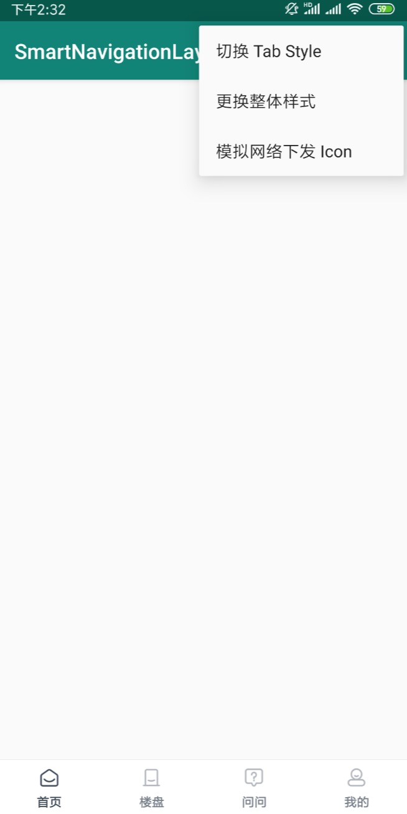
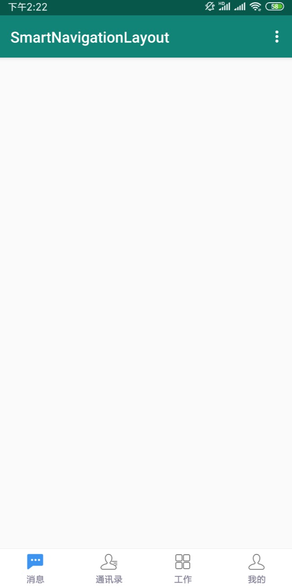
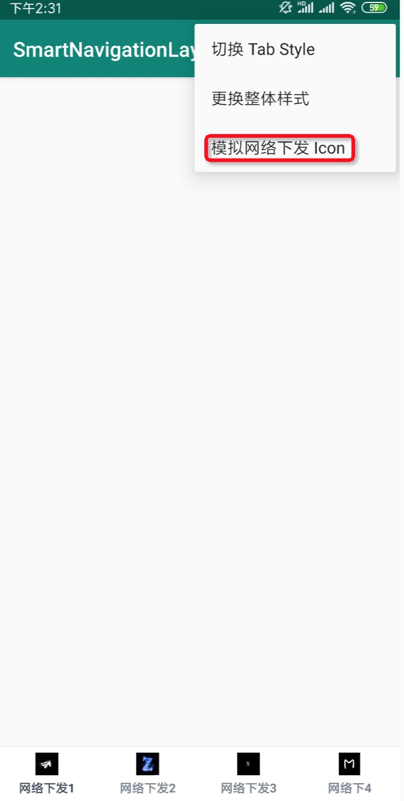

# SmartNavigationLayout


## 功能预览

默认 Navigation 导航




指定单个 tab 样式切换


指定一组 tabs 样式切换





支持 http://.png http://.jpg icon 样式切换





## 核心类

- TabModel
- SmartNavigationLayout 
- TabItemView


**TabModel** : tab 样式的实体类，对 tab 的图片 文字 文字颜色的选中和非选中状态进行描述，采用 Builder 模式为其提供实例产生方式:


```java
new TabModel(2)
      .setImageNormal()
      .setImageSelected()
      .setTextColorNormal()
      .setTextColorSelected()
      .setText()
```

构造函数传参指定 tab 的 index 为必选项，其他为可选项


**SmartNavigationLayout** : 包含 TabItemView 的组合 View ，也是事件的发布者。对外提供 API 功能接口


自定义属性:

|       属性名        |                             释义                             |       单位       |
| :-----------------: | :----------------------------------------------------------: | :--------------: |
|    default_index    | 设置默认选中的 tabs , 不设置默认 index 为 0 。即默认选中第一个 tab |     integer      |
|  text_color_normal  |                      Tabs 的非选中颜色                       | color\|reference |
| text_color_selected |                       Tabs 的选中颜色                        | color\|reference |


API :

|          Method           |         param1         |    param2    |    param3     |                     释义                     |
| :-----------------------: | :--------------------: | :----------: | :-----------: | :------------------------------------------: |
| setOnTabItemClickListener | OnTabItemClickListener |              |               |             Tabs 的点击事件监听              |
|      refreshTabStyle      |        TabModel        |              |               |              刷新指定 tab 样式               |
|    refreshTabListStyle    |     List< TabModel >   |              |               |              刷新一组 tabs 样式              |
|    refreshTabListStyle    |     List< TabModel >   | colorNormal  | colorSelected | 刷新一组 tabs 样式, 指定文字的选中非选中颜色 |
|    setPointVisibility     |         Index          | isVisibility |     count     |          设置指定 tab 红点是否隐藏           |


**TabItemView** : Tab 的 View ，负责处理 Tab 的选中和非选中状态。包含 Tab 的文字、颜色、小红点、Icon 等，也是事件的订阅者。


自定义属性:

|     属性名      |         释义         |   单位    |
| :-------------: | :------------------: | :-------: |
|  tab_image_src  | 默认 tab 的 drawable | reference |
| tab_text_string |      Tab 的文案      | reference |


## 使用

Step 1:

Xml 

```xml
<android.support.v4.view.ViewPager
    android:id="@+id/view_pager" ... />

<View
    android:id="@+id/view_line" ... />


<com.julive.library.navigation.SmartNavigationLayout
    android:id="@+id/smart_navigation_layout"
    android:layout_width="match_parent"
    android:layout_height="54dp"
    android:background="#FFF"
    app:layout_constraintBottom_toBottomOf="parent" />
```

layout/smart_navigation_layout.xml

```xml
<LinearLayout xmlns:android="http://schemas.android.com/apk/res/android"
    xmlns:app="http://schemas.android.com/apk/res-auto"
    android:layout_width="match_parent"
    android:layout_height="match_parent"
    android:orientation="horizontal">

     <com.julive.library.navigation.TabItemView
        android:layout_width="match_parent"
        android:layout_height="match_parent"
        app:tab_image_src="@drawable/selector_tab_home"
        app:tab_text_string="@string/tab_home" />

    <com.julive.library.navigation.TabItemView
        android:layout_width="match_parent"
        android:layout_height="match_parent"
        app:tab_image_src="@drawable/selector_tab_consultant"
        app:tab_text_string="@string/tab_house" />

    <com.julive.library.navigation.TabItemView
        android:layout_width="match_parent"
        android:layout_height="match_parent"
        app:tab_image_src="@drawable/selector_tab_qa"
        app:tab_text_string="@string/tab_qa" />

    <com.julive.library.navigation.TabItemView
        android:layout_width="match_parent"
        android:layout_height="match_parent"
        app:tab_image_src="@drawable/selector_tab_personal"
        app:tab_text_string="@string/tab_personal" />


</LinearLayout>
```


Java


```java
navigationLayout = findViewById(R.id.smart_navigation_layout);
navigationLayout.setOnTabItemClickListener(new OnTabItemClickListener() {
    @Override
    public void itemClick(int index) {
        
    }
});
```


## 权限

```xml
<uses-permission android:name="android.permission.INTERNET" />
```


## TODO

- Tab 小红点功能

- 对网络下发图片 icon bitmap 如果过大的压缩处理

- 去 layout/smart_navigation_layout.xml 化

  